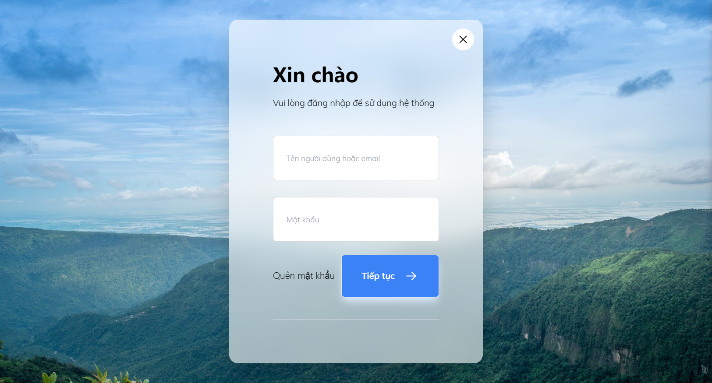
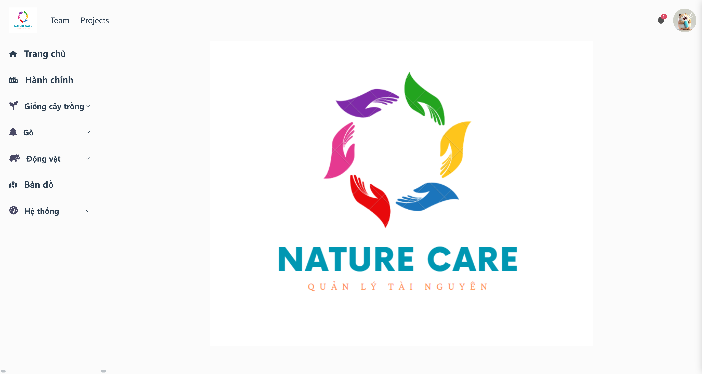
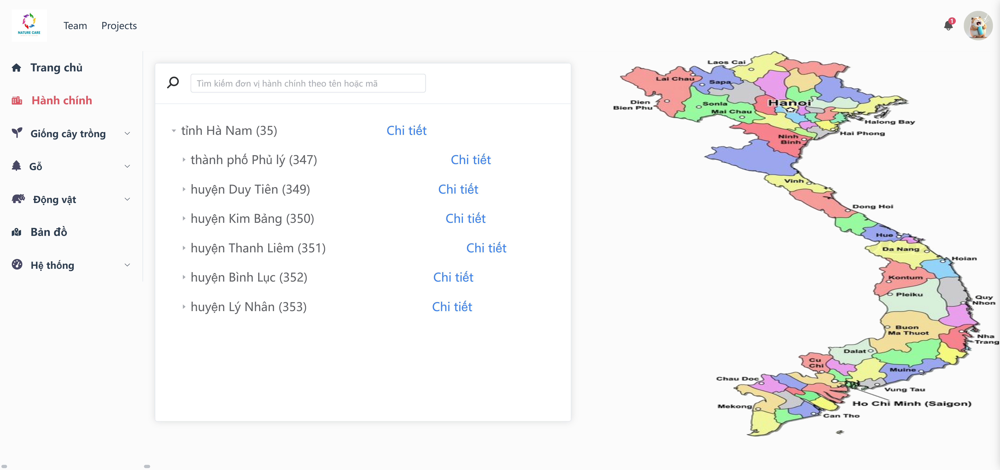
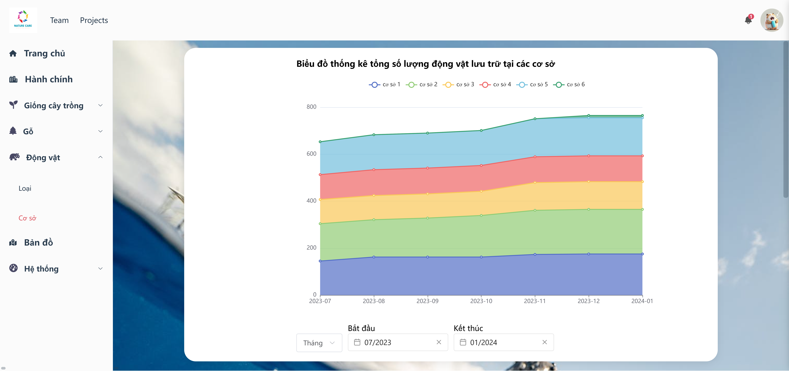

# Forest Resources Manage Application

### Project Description
<p>
This project is intended to help manage the natural resources of the administration such as: woods, animals,... It includes basic functionalities such as:
</p>
<ol>
<li>
Authentication
<ul>
<li>Sign up</li>
<li>Login</li>
<li>Change password</li>
<li>Forget password</li>
</ul>
</li>
<li>
Statistics
<ul>
<li>Update data</li>
<li>Visualization chart</li>
</ul>
</li>
<li>Geographical map</li>
<ul>
<li>Showing the distribution of resource storage facilities</li>
<li>Update location of resource storage facilities</li>
</ul>
<li>
Change user info
<ul>
<li>Update username, email, avatar,...</li>
</ul>
</ol>

---
### What I used
<ul>
<li>Spring</li>
<li>Vue js</li>
<Li>Mysql</Li>
</ul>

---
### How to run

<ol>
<li>Clone this project</li>
<li>Run the sql script: <a href="_database/forest-resources-manage-application.sql">forest-resources-manage-application.sql</a>
to create the database</li>
<li>Change the database configuration in <a href="back-end/forest-resources-manage-application/src/main/resources/application.properties">application.properties</a>
</li>
<li>Move to <a href="back-end/forest-resources-manage-application">back-end folder</a> and run:

```shell
mvnw spring-boot:run
```

</li>
<li>Move to <a href="front-end/forest-resources-manage-application">frontend folder</a>  and run:

```shell
npm install
npm run serve
```
</ol>

---
### Website Preview









